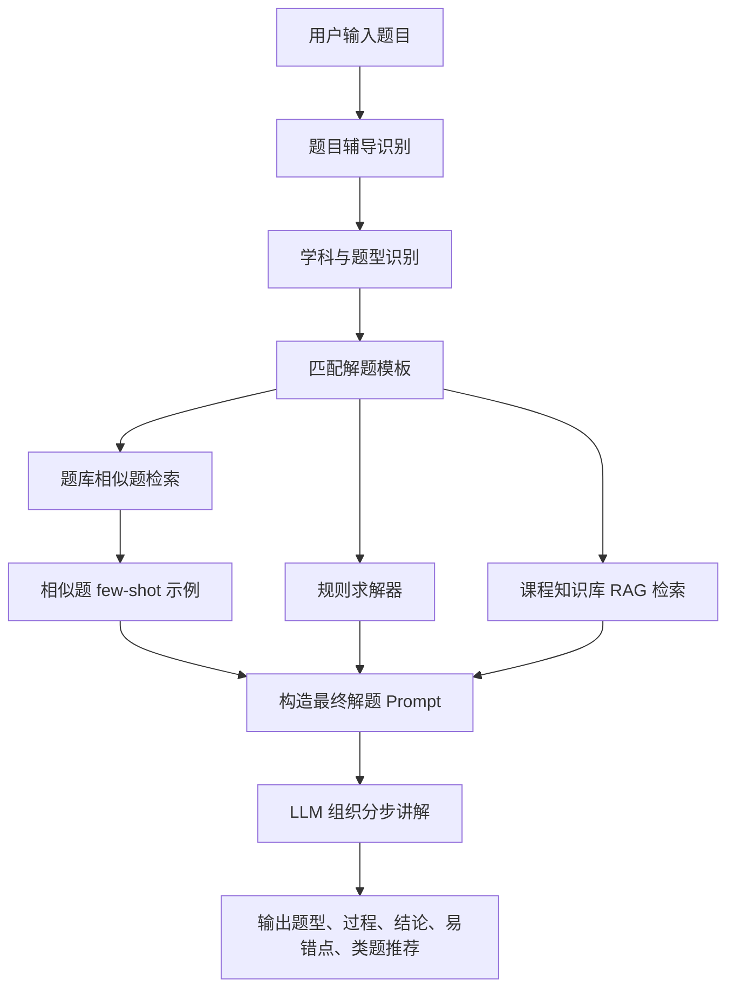

# 题目辅导与过程化解题模块说明

## 一、模块定位

题目辅导与过程化解题模块是学习辅助系统中的“解题型问答”增强模块。它不是替代原有课程知识库问答，而是在用户输入明显属于课程题目时，自动或手动进入更适合教学场景的处理链路。

原有问答链路主要解决“知识点是什么、概念怎么理解、章节内容怎么总结”等问题；题目辅导模块进一步解决“这道题怎么做、条件怎么抽取、算法怎么算、考试答案怎么写、还能练哪类题”等问题。

当前模块覆盖三门课程：

- C语言
- 操作系统
- 网络安全实验

## 二、建设必要性

该模块对学习辅助系统是必要的，原因主要有三点。

第一，学生提问经常不是单纯概念问答，而是带有题干、代码、表格、访问序列、实验现象的解题请求。普通 RAG 问答容易给出概念解释，但不一定能稳定完成条件抽取和分步推导。

第二，过程化解题更符合教学场景。学生不仅需要最终答案，还需要看到题型判断、考点定位、条件抽取、推导过程、易错点和类题训练方向。

第三，部分题型可以用确定性规则求解器计算。比如页面置换、进程调度、银行家算法、DH 模运算等，直接用程序计算比完全依赖大模型更可靠，也更适合展示系统的可解释性。

## 三、总体流程



当前运行优先级如下：

```text
C 代码分析
-> 题目辅导
-> 寒暄快答
-> 普通课程问答 / RAG
```

如果用户点击前端“题目辅导”按钮，会强制发送 `problem_tutoring: true`，后端直接进入题目辅导链；如果用户没有点击按钮，系统也会根据“这题怎么做、页面置换、银行家算法、程序输出、实验现象分析”等关键词自动识别。

## 四、题库作用

题库文件位于：

```text
data/tutoring_question_bank/questions.jsonl
```

当前规模为 300 道，三科各 100 道：

- C语言：`c_001` 到 `c_100`
- 操作系统：`os_001` 到 `os_100`
- 网络安全实验：`sec_001` 到 `sec_100`

每道题包含：

```text
id
subject_id
problem_type
knowledge_points
difficulty
question
answer
solution_steps
common_mistakes
```

题库在当前系统中有三层作用：

第一，用于类题推荐。用户问一道题后，系统会从题库中检索同学科、同题型、相近知识点的题目，推荐真实题号和题干。

第二，用于 few-shot 标准解法示例。系统会取 Top 1-2 道相似题，把它们的 `answer`、`solution_steps`、`common_mistakes` 压缩后放入最终 prompt。LLM 只模仿解题结构和步骤粒度，不照搬示例题的具体数值或结论。

第三，用于离线评测。系统可以扫描 300 道题库，统计学科识别、题型识别、类题推荐和规则求解器覆盖情况。

## 五、规则求解器

规则求解器负责处理适合确定性计算或结构化生成的题型。它的输出会以 `solver_result` 形式写入最终 prompt。如果 `status=success`，LLM 必须优先采用规则求解器的数值、过程和结论。

当前支持：

| 课程 | 题型 | 支持内容 |
| --- | --- | --- |
| 操作系统 | 页面置换 | FIFO、LRU、OPT、Clock，输出缺页次数、命中次数、缺页率和过程表 |
| 操作系统 | 进程调度 | FCFS、SJF、SRTF、RR，输出时间轴、完成时间、周转时间、等待时间 |
| 操作系统 | 银行家算法 | Need 计算、安全性检查、安全序列、Request 试分配 |
| 操作系统 | PV 同步互斥 | 生产者消费者、读者写者、前驱关系的信号量设计框架 |
| 网络安全实验 | DH 密钥交换 | 根据 p、g、a、b 计算公开值和共享密钥 |

对于 C语言输出题、指针题、函数调用题和找错题，当前主要采用“题型模板 + 课程 RAG + 相似题 few-shot + LLM 推理”的方式处理；后续可以继续补 C 语言表达式/小代码片段的规则解释器。

## 六、当前评测结果

评测命令：

```bash
python utils/evaluate_problem_tutoring.py
```

基于 300 道题库的当前评测结果：

| 指标 | 结果 |
| --- | ---: |
| 总题数 | 300 |
| 学科识别准确率 | 100.0% |
| 题型识别准确率 | 100.0% |
| 类题推荐非空率 | 100.0% |
| 类题推荐 Top1 同学科率 | 100.0% |
| 类题推荐 Top1 同题型率 | 99.33% |
| 规则求解整体命中率 | 36.33% |
| 规则可解题覆盖率 | 96.46% |
| 需要 LLM 兜底比例 | 63.67% |

按学科统计：

| 学科 | 题数 | 学科识别 | 题型识别 | 规则求解 |
| --- | ---: | ---: | ---: | ---: |
| C语言 | 100 | 100.0% | 100.0% | 0.0% |
| 操作系统 | 100 | 100.0% | 100.0% | 96.0% |
| 网络安全实验 | 100 | 100.0% | 100.0% | 13.0% |

规则求解器命中数：

| 求解器 | 命中数 |
| --- | ---: |
| 页面置换 | 18 |
| 进程调度 | 46 |
| 银行家算法 | 16 |
| PV 同步互斥 | 16 |
| DH 密钥交换 | 13 |

需要说明的是，规则求解整体命中率 36.33% 并不代表系统只能解决 36.33% 的题。题库中有大量 C 语言代码解释题、网络安全概念题、实验步骤题和一般简答题，这些本来就更适合由模板、RAG 和 LLM 进行讲解。更关键的指标是“规则可解题覆盖率”，当前为 96.46%。

## 七、演示样例

### 1. 操作系统：银行家算法 Request 试分配

输入：

```text
银行家算法：Available=(3,3,2)。Allocation：P0(0,1,0), P1(2,0,0), P2(3,0,2), P3(2,1,1), P4(0,0,2)。Max：P0(7,5,3), P1(3,2,2), P2(9,0,2), P3(2,2,2), P4(4,3,3)。P1 请求 Request=(1,0,2)，判断是否可分配。
```

预期展示点：

```text
题型：银行家算法 Request 试分配
Request <= Need：成立
Request <= Available：成立
试分配后 Available=(2,3,0)
系统仍安全
可以分配
安全序列：P1 -> P3 -> P4 -> P0 -> P2
回答元信息：题目辅导 | 规则求解
```

### 2. 操作系统：Clock 页面置换

输入：

```text
页面访问序列为 1,2,3,1,4,5，页框数为 3，采用 Clock 页面置换，求缺页次数。
```

预期展示点：

```text
题型：页面置换
算法：Clock
缺页次数：5
命中次数：1
展示每次访问后的页框状态、引用位变化和被置换页面
```

### 3. 操作系统：SRTF 调度

输入：

```text
进程 [('P1', 0, 8), ('P2', 1, 4), ('P3', 2, 2)] 采用 SRTF 调度，求完成时间。
```

预期展示点：

```text
题型：抢占式最短剩余时间优先调度
P3 完成时间：4
P2 完成时间：7
P1 完成时间：14
展示调度时间轴和周转/等待时间
```

### 4. 网络安全实验：DH 密钥交换

输入：

```text
DH 密钥交换实验：公开 p=23，g=5。甲的私钥 a=6，乙的私钥 b=15。求双方公开值和共享密钥。
```

预期展示点：

```text
甲公开值 A=8
乙公开值 B=19
共享密钥 K=2
说明每一步都要取模，以及私钥不能直接发送
```

## 八、当前局限

当前模块仍有以下局限：

- C语言题暂未做完整的确定性执行器，复杂代码输出仍依赖 LLM 手动跟踪和已有 C 代码分析能力。
- 题库相似检索仍是本地词面相似度，不是 embedding 语义检索；300 道题规模下够用，扩展到几千道后应升级为 embedding 检索。
- PV 同步互斥题当前生成的是结构化模板，不会自动证明所有并发边界条件。
- 评测主要衡量识别、推荐和规则覆盖，还没有做 LLM 最终答案的自动语义判分。

## 九、后续优化方向

建议后续按以下顺序继续：

1. 增加 C语言小代码片段的确定性求解能力，例如简单循环、数组下标、指针移动、函数调用输出。
2. 将题库检索升级为 embedding 检索，提高用户换说法时的类题推荐稳定性。
3. 增加最终答案质量评测，例如基于标准答案要点的自动打分。
4. 增加前端“规则计算结果”折叠区，让用户能直接看到系统计算出的结构化中间结果。
5. 扩充真实课程题库，按章节、题型和难度维护更均衡的数据分布。

## 十、答辩表述建议

可以这样概括该模块：

```text
本系统在原有课程 RAG 问答基础上，增加了题目辅导与过程化解题模块。模块通过题型识别、模板匹配、课程知识检索、题库相似题 few-shot 和规则求解器协同工作，实现从“问知识点”到“分步做题”的能力升级。

在 300 道三学科题库上的离线评测中，系统学科识别和题型识别准确率均达到 100%，类题推荐 Top1 同题型率达到 99.33%。对于适合规则计算的题型，规则求解覆盖率达到 96.46%。这说明模块具备较稳定的题目识别、过程化求解和类题迁移能力。
```
